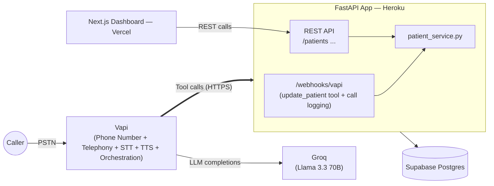

# Voice AI Patient Registration Agent — Implementation Plan

**Based on:** *Voice AI Agent — Patient Registration Take-Home Technical Assessment*
**Chosen stack:** FastAPI (backend) · Next.js (dashboard) · **Vapi** (managed voice platform: telephony + STT + TTS + orchestration) · Groq (LLM, via Vapi) · Supabase (Postgres) · Heroku (backend hosting) · Vercel (dashboard hosting)

> **Revision note:** This plan replaces the original Twilio + Pipecat + Deepgram + Cartesia/ElevenLabs custom voice pipeline with **Vapi**. Vapi bundles telephony, streaming STT, an LLM layer, and low-latency TTS behind one API, and gives you a **free U.S. phone number with no Twilio account required**. This removes the entire custom audio pipeline (WebSocket media streams, VAD, manual STT/TTS wiring, Twilio trial-account gotchas) and replaces it with configuring one Vapi Assistant. The trade-off — less low-level control over the audio stack — is explicitly acceptable here: the assessment's own FAQ says using a platform like Vapi is *encouraged*, since it's evaluating integration and system design, not STT/TTS implementation skill.

---

## 1. Objective

Build a phone-reachable voice agent that conversationally collects U.S. patient demographic data, persists it to Supabase, exposes it through a FastAPI REST API, and displays it in a Next.js dashboard — end-to-end, callable, and reviewable at any time.

The assessment scores five dimensions equally (20% each): **Working System, Conversational Quality, Technical Architecture, Code Quality/Docs, Edge Cases/Resilience.** This plan is sequenced so the "Working System" score is secured first, then quality is layered on.

---

## 2. Tech Stack & Justification

| Layer | Choice | Why |
|---|---|---|
| Telephony, STT, TTS, orchestration | **Vapi** | Provisions a real, dialable U.S. number directly from its dashboard/API — **no Twilio account needed**. Handles turn-taking, interruption/VAD, streaming STT, and TTS internally, so there's no custom audio pipeline to build or debug inside a 3-hour window. New accounts get free trial credit with no card required. |
| LLM | **Groq** (Llama 3.3 70B, `llama-3.3-70b-versatile`) | Groq is a first-class, natively supported model provider inside a Vapi Assistant (`model.provider: "groq"`) — you just paste a Groq API key into Vapi's provider-keys page and select it. Sub-second inference keeps the conversation feeling natural. Supports OpenAI-style function/tool calling, which is how the agent triggers patient CRUD. |
| Voice (TTS) | **Vapi's bundled default voice** | Ships with Vapi, no separate account/key, no extra per-character billing — sufficient for a demo. Swap for an ElevenLabs voice later only if you want a specific voice character. |
| Backend API | **FastAPI** | Async-native, Pydantic validation gives server-side field validation "for free," auto-generated OpenAPI docs. Now a **pure HTTPS REST service** — no WebSocket audio endpoint required, since Vapi owns the entire call. |
| Database | **Supabase (Postgres)** | Managed Postgres with proper types/constraints, survives restarts trivially, and gives a REST/Studio UI for free during debugging. |
| Dashboard | **Next.js on Vercel** | Fastest path to a presentable "Dashboard" bonus item; App Router + server components keep it to a couple of files. |
| Hosting | **Heroku** (backend) · **Vercel** (dashboard) | Kept from the original plan for consistency. Note the constraint that originally *required* Heroku — native WebSocket support for Twilio Media Streams — **no longer applies**, since Vapi's tool calls are plain HTTPS requests. Any HTTPS-reachable host (Render, Railway, Fly.io) now works equally well; Heroku is kept here only because it's already the team's default. |

> **What Vapi replaces, concretely:** Twilio (carrier + Media Streams), Pipecat + pipecat-flows (orchestration/state machine), Deepgram (STT), and Cartesia/ElevenLabs (TTS) are all removed. Vapi is the telephony carrier, the STT engine, the TTS engine, and the real-time orchestrator, all in one managed product. Groq remains in the stack, but it's now configured *inside* Vapi rather than called directly from your own server process.

---

## 3. High-Level Architecture



**Key design decision — how the voice agent talks to the database:**
The spec allows the voice agent to either "use the REST API" **or** "directly invoke the same service layer." This plan uses whichever fits each HTTP verb naturally:

- **`lookup_patient_by_phone`** and **`create_patient`** are Vapi **API Request tools** — Vapi makes the HTTP call itself, directly to your live `GET /patients` and `POST /patients` endpoints. This is a literal, direct use of the public REST API — no adapter layer in between.
- **`update_patient`** is a Vapi **Function tool**, because Vapi's API Request tool type only supports `GET`/`POST`, not `PUT`. It's routed to a small `/webhooks/vapi` endpoint on your backend, which calls `patient_service.update_patient()` directly — the exact same function the `PUT /patients/{id}` route uses. Same validation, same code path, just invoked in-process instead of over HTTP.

This keeps validation logic in exactly one place (`patient_service.py` + the Pydantic schemas) regardless of which path a given call takes.

---

## 4. Data Model

Unchanged by the telephony swap — maps directly to the spec's field list, expressed as a Supabase/Postgres migration.

```sql
create extension if not exists pgcrypto;

create table patients (
    patient_id              uuid primary key default gen_random_uuid(),
    first_name              text not null check (char_length(first_name) between 1 and 50),
    last_name               text not null check (char_length(last_name) between 1 and 50),
    date_of_birth            date not null check (date_of_birth <= current_date),
    sex                      text not null check (sex in ('Male','Female','Other','Decline to Answer')),
    phone_number             text not null check (phone_number ~ '^\d{10}$'),
    email                    text check (email ~* '^[^@\s]+@[^@\s]+\.[^@\s]+$'),
    address_line_1           text not null,
    address_line_2           text,
    city                     text not null check (char_length(city) between 1 and 100),
    state                    text not null check (char_length(state) = 2),
    zip_code                 text not null check (zip_code ~ '^\d{5}(-\d{4})?$'),
    insurance_provider       text,
    insurance_member_id      text,
    preferred_language       text default 'English',
    emergency_contact_name   text,
    emergency_contact_phone  text check (emergency_contact_phone ~ '^\d{10}$'),
    created_at               timestamptz not null default now(),
    updated_at               timestamptz not null default now(),
    deleted_at               timestamptz
);

create index idx_patients_phone on patients (phone_number) where deleted_at is null;
create index idx_patients_last_name on patients (last_name) where deleted_at is null;

create or replace function set_updated_at() returns trigger as $$
begin
  new.updated_at = now();
  return new;
end;
$$ language plpgsql;

create trigger trg_patients_updated_at
before update on patients
for each row execute function set_updated_at();
```

Seed 1–2 rows for demo purposes in a separate `seed.sql`.

---

## 5. REST API Contract

| Method | Endpoint | Notes |
|---|---|---|
| `GET` | `/patients` | Query params: `last_name`, `date_of_birth`, `phone_number`. Excludes soft-deleted rows. **Called directly by Vapi's `lookup_patient_by_phone` tool.** |
| `GET` | `/patients/{patient_id}` | 404 if not found or soft-deleted. |
| `POST` | `/patients` | Pydantic model enforces validation rules server-side, independent of the voice agent. Returns 201 + record. **Called directly by Vapi's `create_patient` tool.** |
| `PUT` | `/patients/{patient_id}` | Partial update (all fields optional in the request model). Same underlying function as the voice agent's `update_patient` tool. |
| `DELETE` | `/patients/{patient_id}` | Sets `deleted_at`; never a hard delete. |

Every response uses the envelope required by the spec:

```json
{ "data": { "...": "..." }, "error": null }
```

and on failure:

```json
{ "data": null, "error": { "code": "VALIDATION_ERROR", "message": "phone_number must be 10 digits", "field": "phone_number" } }
```

Implement this as a shared Pydantic `ApiResponse[T]` wrapper + a FastAPI exception handler so every route doesn't hand-roll it.

> **Voice-specific note:** because Vapi's `create_patient` tool hits `POST /patients` directly, the JSON body of a `422` response is what the LLM sees as the tool result. Write `error.message` in plain, caller-relayable language (e.g. `"phone_number must be exactly 10 digits"`, not `"ValidationError: pattern mismatch"`), since the system prompt instructs the agent to read tool errors back to the caller as a targeted re-prompt.

---

## 6. Repository Structure

```
Patient-Registration-System-Voice-Agent/
├── backend/
│   ├── app/
│   │   ├── main.py                       # FastAPI app, mounts REST + webhook routers
│   │   ├── api/routes/patients.py        # REST CRUD endpoints
│   │   ├── api/routes/vapi_webhook.py    # POST /webhooks/vapi — update_patient tool + call logging
│   │   ├── models/patient.py             # SQLAlchemy / Supabase table model
│   │   ├── schemas/patient.py            # Pydantic request/response models
│   │   ├── services/patient_service.py   # shared logic used by REST routes + the update_patient webhook
│   │   ├── voice/
│   │   │   ├── prompts.py                # Vapi Assistant system prompt (documented, see §7)
│   │   │   └── tool_schemas.py           # Vapi tool JSON schemas: lookup/create/update/endCall
│   │   ├── db/supabase_client.py
│   │   └── core/config.py                # env var loading
│   ├── scripts/
│   │   └── setup_vapi_assistant.py       # creates/updates the Vapi Assistant + phone number via the Vapi API
│   ├── tests/
│   │   ├── test_patients_api.py
│   │   └── test_vapi_webhook.py
│   ├── requirements.txt
│   ├── Procfile                          # web: uvicorn app.main:app --host 0.0.0.0 --port $PORT
│   └── .env.example
├── frontend/
│   ├── app/page.tsx                      # patient list + search
│   ├── app/patients/[id]/page.tsx        # patient detail
│   ├── lib/api.ts
│   └── .env.example
├── supabase/migrations/0001_init.sql
└── README.md
```

Note what's **gone** compared to the Twilio-based version: `voice/ws_routes.py`, `voice/pipeline.py`, `voice/flow.py`, and `voice/tools.py`'s handler code. There is no WebSocket route, no Pipecat pipeline, and no hand-rolled state machine — Vapi owns all of that.

---

## 7. Voice Agent Design

### 7.1 Conversation flow (via the Vapi Assistant's system prompt + tool preconditions)

Vapi doesn't use `pipecat-flows`; there's no separate state-machine file. Determinism instead comes from a clearly sequenced system prompt combined with tool descriptions that gate *when* each tool may be called. In practice this reads almost identically to the original flow:

1. **Greeting** → "Hi, thanks for calling [Practice Name]. I can help you register as a new patient — do you have a few minutes?"
2. **Required fields**, collected conversationally in natural clusters (not one-by-one interrogation):
   - Name → DOB → Sex
   - Phone → Email (skip if declined)
   - Address (line 1, line 2, city, state, zip)
3. **Duplicate check (bonus):** as soon as the phone number is captured, call `lookup_patient_by_phone`. If a match exists: *"It looks like we already have a record for [First] [Last] — want me to update that instead of creating a new one?"* → branches to the update path.
4. **Optional fields offer:** *"I can also grab insurance info, an emergency contact, and your preferred language if you'd like — want to add any of that?"*
5. **Read-back & confirm:** agent restates every collected field, asks explicitly "Did I get all of that right?" Any correction re-enters that specific field's collection — never a full restart.
6. **Save:** call `create_patient` (or `update_patient`) — **only after explicit verbal confirmation** — then relay success/failure to the caller based on the tool's JSON result.
7. **Close:** *"You're all set, [First Name]. Thanks for calling — have a great day!"* → call the built-in `endCall` tool.

### 7.2 System prompt (skeleton — full version goes in `voice/prompts.py`, commented)

```
You are a warm, efficient intake coordinator collecting patient registration
details over the phone. Rules:
- Speak naturally, in short sentences. Never read the field list like a form.
- Validate as you go: dates must be real and not in the future; phone
  numbers must be 10 digits; state must be a real 2-letter abbreviation.
  If something's invalid, ask again for just that field — don't restart.
- Never guess a spelling. If a name sounds ambiguous, ask the caller to
  spell it.
- Call lookup_patient_by_phone as soon as you have a phone number, before
  collecting anything else that depends on whether this is a new or
  returning patient.
- After all required fields are collected, always read the full set back
  and get explicit confirmation before calling create_patient or
  update_patient. Never call either tool without that confirmation.
- If the caller says "start over" or "actually, let's redo this," reset
  only the fields collected so far, not the whole call.
- If create_patient or update_patient returns an error, read the error's
  message back in plain language, ask specifically for that field again,
  and reassure the caller their other answers were not lost. Never go
  silent on a tool failure.
- When the registration is complete and confirmed, say a brief personalized
  goodbye and then call endCall.
```

### 7.3 Tool definitions (Vapi tools)

```json
[
  {
    "type": "apiRequest",
    "name": "lookup_patient_by_phone",
    "description": "Look up an existing patient by 10-digit phone number. Call this as soon as the caller's phone number has been collected.",
    "apiRequest": {
      "url": "https://<your-api-host>/patients?phone_number={{phone_number}}",
      "method": "GET",
      "timeoutSeconds": 15
    },
    "parameters": {
      "type": "object",
      "properties": { "phone_number": { "type": "string", "description": "10-digit phone number, digits only" } },
      "required": ["phone_number"]
    }
  },
  {
    "type": "apiRequest",
    "name": "create_patient",
    "description": "Create a new patient record. Only call this after the caller has explicitly confirmed every collected field is correct.",
    "apiRequest": {
      "url": "https://<your-api-host>/patients",
      "method": "POST",
      "headers": { "Content-Type": "application/json" },
      "timeoutSeconds": 20,
      "backoffPlan": { "maxRetries": 2 }
    },
    "parameters": { "...": "mirrors the Pydantic PatientCreate model" }
  },
  {
    "type": "function",
    "name": "update_patient",
    "description": "Update an existing patient's record by patient_id, after the caller confirms they want to update instead of create.",
    "server": { "url": "https://<your-api-host>/webhooks/vapi" },
    "parameters": { "...": "mirrors PatientUpdate, plus patient_id" }
  },
  {
    "type": "endCall",
    "name": "endCall",
    "description": "End the call gracefully once registration is confirmed and the goodbye has been said."
  }
]
```

Notes:
- `lookup_patient_by_phone` and `create_patient` are **API Request tools** — Vapi builds and sends the HTTP request itself, straight to your live REST endpoints. The JSON response becomes the tool result the LLM sees directly.
- `update_patient` is a **Function tool** (API Request tools don't support `PUT`) — it's routed to `POST /webhooks/vapi`, which dispatches to `patient_service.update_patient()`.
- Set a **Server URL Secret** on the assistant (Vapi sends it as a header, e.g. `X-Vapi-Secret`) and verify it in `/webhooks/vapi` before processing anything — this is the basic input-sanitization/security control for that one custom endpoint.
- `scripts/setup_vapi_assistant.py` is what actually creates/updates these tools and the assistant via the Vapi API, so the whole configuration is reproducible from source instead of only living in the dashboard.

---

## 8. Implementation Phases

Ordered so a fully working (if minimal) end-to-end call is possible before polish begins — protects the "Working System" 20% even if time runs short. Each phase has a **ready-to-use prompt** — paste it into Claude Code, Cursor, or any AI coding assistant to execute that phase.

| Phase | Goal | Est. time | Priority |
|---|---|---|---|
| 0. Setup | Accounts & scaffolding | 15 min | Must |
| 1. Database | Schema live on Supabase | 15 min | Must |
| 2. REST API | CRUD works via curl/Postman | 40 min | Must |
| 3. Vapi Assistant & Tools | Number provisioned, call connects, tools wired | 25 min | Must |
| 4. Conversation flow & prompt engineering | Full registration end-to-end | 30 min | Must |
| 5. Validation & edge cases | Re-prompts, corrections, duplicate detection | 25 min | Should |
| 6. Deployment | Live and callable | 15 min | Must |
| 7. Dashboard | Patients visible in a UI | 30–40 min | Should |
| 8. Tests & README | Reviewable | 25 min | Must |
| 9. Stretch/bonus | Extra credit | remaining time | Could |

**Running total for Phases 0–6 + 8 (the core, gradeable path): ~3h 10min.** This is tighter than the original Twilio/Pipecat plan (~3h30–3h50) precisely because there's no custom audio pipeline to build or debug — that was the highest-risk, hardest-to-verify part of the original plan, and it's gone entirely. If you're still behind:
- Trim Phase 5 to just the two hard-required edge cases (invalid DOB, invalid phone) and defer the rest to "Known Limitations" in the README, **or**
- Cut Phase 7 (dashboard) first — it's a bonus item, not core-scored.

The spec explicitly states partial-but-working beats complete-but-broken: if you're at the 3-hour mark mid-Phase-5, stop, deploy what you have, and write down what's left under "Next Steps."

### 8.0 Phase 0 — Setup & Scaffolding

**Goal:** accounts provisioned, repo skeleton in place, nothing functional yet.

```
Set up a new project called Patient-Registration-System-Voice-Agent with two
folders: backend/ (Python 3.11 FastAPI project) and frontend/ (Next.js 14
App Router, TypeScript, Tailwind). Initialize git with a .gitignore covering
Python and Node. In backend/, create requirements.txt with: fastapi,
uvicorn[standard], pydantic, supabase, python-dotenv, requests, pytest,
httpx. Create backend/.env.example with placeholders for SUPABASE_URL,
SUPABASE_SERVICE_KEY, VAPI_API_KEY, VAPI_SERVER_SECRET, GROQ_API_KEY,
PUBLIC_API_BASE_URL. Build out this exact folder structure with empty
modules and docstrings (no business logic yet):

backend/app/{main.py, api/routes/patients.py, api/routes/vapi_webhook.py,
models/patient.py, schemas/patient.py, services/patient_service.py,
voice/{prompts.py,tool_schemas.py}, db/supabase_client.py, core/config.py}
backend/scripts/setup_vapi_assistant.py
backend/tests/{test_patients_api.py, test_vapi_webhook.py}

main.py should be a minimal FastAPI app exposing GET /health returning
{"status": "ok"}. Also scaffold frontend/ with a default Next.js app and a
frontend/.env.example containing NEXT_PUBLIC_API_BASE_URL. Don't install
anything yet or write real logic — just the skeleton and dependency files.
Do NOT include twilio, pipecat, deepgram, or any TTS/STT SDK — Vapi handles
all of that outside this codebase.
```

### 8.1 Phase 1 — Database

**Goal:** schema live and verified on Supabase.

```
Write a Postgres migration at supabase/migrations/0001_init.sql that creates
a `patients` table with these columns and constraints:
- patient_id uuid primary key, default gen_random_uuid()
- first_name, last_name: text, not null, 1-50 chars
- date_of_birth: date, not null, must not be in the future
- sex: text, not null, one of 'Male','Female','Other','Decline to Answer'
- phone_number: text, not null, exactly 10 digits
- email: text, nullable, basic email format check
- address_line_1: text, not null; address_line_2: text, nullable
- city: text, not null, 1-100 chars
- state: text, not null, exactly 2 chars
- zip_code: text, not null, 5-digit or ZIP+4 format
- insurance_provider, insurance_member_id: text, nullable
- preferred_language: text, default 'English'
- emergency_contact_name: text, nullable
- emergency_contact_phone: text, nullable, 10-digit format if present
- created_at, updated_at: timestamptz, default now()
- deleted_at: timestamptz, nullable (soft delete)

Add a trigger that sets updated_at = now() on every UPDATE. Add partial
indexes on phone_number and last_name that exclude rows where deleted_at is
not null. Then write supabase/seed.sql with 2 fake demo patients (clearly
fictional data, not real people). Finally, give me the exact Supabase CLI
commands (or SQL editor steps) to apply both files to my Supabase project.
```

### 8.2 Phase 2 — REST API

**Goal:** all five patient endpoints work against Supabase, independently of the voice agent.

```
Implement the patient REST API in backend/app/:

1. schemas/patient.py — Pydantic models PatientCreate, PatientUpdate (every
   field optional), and PatientOut. Add validators: phone_number and
   emergency_contact_phone must be exactly 10 digits; state must be a valid
   2-letter USPS abbreviation; zip_code must match 5-digit or ZIP+4; email
   must be a valid format if provided; date_of_birth must not be in the
   future. Write every validation error message in plain, caller-readable
   language (e.g. "phone_number must be exactly 10 digits") since a voice
   agent will relay these messages back to a caller verbatim.
2. db/supabase_client.py — a thin wrapper initializing the Supabase client
   from SUPABASE_URL / SUPABASE_SERVICE_KEY (loaded via core/config.py).
3. services/patient_service.py — list_patients(filters), get_patient(id),
   create_patient(data), update_patient(id, data), soft_delete_patient(id).
   All reads exclude rows where deleted_at is not null.
4. api/routes/patients.py — a FastAPI router:
   GET /patients (query params: last_name, date_of_birth, phone_number)
   GET /patients/{patient_id}
   POST /patients
   PUT /patients/{patient_id}
   DELETE /patients/{patient_id}  (soft delete only, never hard delete)
5. A generic ApiResponse[T] wrapper and a global exception handler so every
   response — success or failure — is shaped { "data": ..., "error": ... }.
   Use status codes 201 (create), 200 (read/update/delete), 404 (missing),
   422 (validation failure), 500 (unexpected).

Wire the router into main.py. Do not touch the voice/ module in this pass.
When done, give me example curl commands for all 5 endpoints.
```

### 8.3 Phase 3 — Vapi Assistant & Tools Setup

**Goal:** a free Vapi phone number exists, a basic assistant answers and talks, and all four tools are wired — before adding full conversation logic.

```
Set up the Vapi voice assistant for patient registration. No WebSocket or
audio pipeline code — Vapi handles telephony, STT, and TTS entirely; we are
only configuring an Assistant and its Tools via the Vapi API.

1. app/voice/tool_schemas.py — Python dicts for four Vapi tools:
   - lookup_patient_by_phone: type "apiRequest", method GET, url built from
     PUBLIC_API_BASE_URL + "/patients", with a phone_number parameter
     templated into the query string.
   - create_patient: type "apiRequest", method POST, url
     PUBLIC_API_BASE_URL + "/patients", body schema mirroring PatientCreate.
   - update_patient: type "function", server.url PUBLIC_API_BASE_URL +
     "/webhooks/vapi", parameters mirroring PatientUpdate plus patient_id.
   - endCall: Vapi's built-in end-call tool.
2. app/voice/prompts.py — a SYSTEM_PROMPT constant with a temporary,
   minimal placeholder prompt: "You are a friendly assistant. Greet the
   caller and ask if they can hear you okay." (full registration prompt
   comes in Phase 4).
3. app/api/routes/vapi_webhook.py — POST /webhooks/vapi that:
   - Rejects the request with 401 unless header X-Vapi-Secret matches
     VAPI_SERVER_SECRET.
   - For a message.type of "tool-calls" containing an update_patient call,
     calls services/patient_service.update_patient() and returns Vapi's
     expected { "results": [{ "toolCallId": ..., "result": ... }] }
     envelope.
   - For a message.type of "end-of-call-report", logs the call summary/
     transcript to stdout.
   - For anything else, return 200 with an empty body.
4. backend/scripts/setup_vapi_assistant.py — reads VAPI_API_KEY, GROQ_API_KEY
   (to confirm it's set — the actual key is entered into Vapi's own
   Provider Keys page, not sent by this script per call), and
   PUBLIC_API_BASE_URL from env. Calls the Vapi REST API to create (or
   update, if VAPI_ASSISTANT_ID is already set) one Assistant with:
   model.provider "groq", model.model "llama-3.3-70b-versatile", the
   system prompt from prompts.py, the four tools from tool_schemas.py, a
   default Vapi voice, and a short firstMessage greeting. Then create (or
   reuse) a free Vapi phone number and attach it to this assistant. Print
   the resulting assistant ID and phone number.

Tell me the exact manual steps too: signing up at vapi.ai, pasting a Groq
key into Vapi's Provider Keys page, running the setup script, and making a
first test call to confirm audio round-trips both ways.
```

### 8.4 Phase 4 — Conversation Flow & Prompt Engineering

**Goal:** a full, natural registration conversation that ends with a saved patient record.

```
Replace the placeholder prompt in app/voice/prompts.py with the complete,
well-commented system prompt for patient registration:
- Speak naturally and briefly; never read the field list like a form.
- Collect required fields in natural clusters: name → DOB → sex, then
  phone → email, then address (line 1, line 2, city, state, zip).
- Call lookup_patient_by_phone as soon as the phone number is captured. If
  a match is found, ask whether to update that record instead of creating
  a new one, and switch to collecting only the fields being changed.
- Offer optional fields once required ones are done: insurance, emergency
  contact, preferred language — opt-in, never asked by default.
- Read back every collected field and get explicit confirmation ("did I
  get that right?") before calling create_patient or update_patient. Never
  call either tool without that confirmation.
- Never guess a spelling; ask the caller to spell an ambiguous name.
- If a "start over" request comes in, reset only the fields collected so
  far in the current section, not the whole call.
- On a tool error, read the error's message back in plain language, target
  a re-prompt at just that field, and reassure the caller nothing else was
  lost.
- After a successful save, give a brief personalized goodbye, then call
  endCall.

Update tool_schemas.py's parameter descriptions if needed so the model
reliably extracts structured values (e.g. phone_number as digits only,
state as a 2-letter code) before calling each tool. Re-run
scripts/setup_vapi_assistant.py to push the updated assistant. Then walk me
through making a full test call — I want to complete an entire registration
end-to-end and confirm the row shows up via GET /patients.
```

### 8.5 Phase 5 — Validation & Edge Cases

**Goal:** the agent degrades gracefully instead of breaking on bad input, drops, or DB failures.

```
Harden the system for these specific cases:

1. Invalid date of birth (future date, or unparseable) -> agent re-prompts
   only the date_of_birth field, doesn't restart the whole form, and
   doesn't proceed until it's valid. Verify this by testing a real call.
2. Invalid phone number (not 10 digits) -> same targeted re-prompt
   behavior, scoped to just that field.
3. Caller says something like "actually, let's start over" -> agent resets
   only the fields collected in the current section, and confirms out loud
   what was kept vs. cleared.
4. Simulate a Supabase outage: temporarily break the SUPABASE_SERVICE_KEY
   and make a test call through to the create_patient step. Confirm what
   the caller actually hears — the system prompt says to apologize and
   offer a retry, but verify Vapi's apiRequest tool actually surfaces a
   non-2xx response to the model as an error rather than the call going
   silent. Document the observed behavior in the README either way.
5. Mid-call correction after a field was already confirmed earlier in the
   call (e.g. "actually my last name is spelled D-A-V-I-S") -> agent
   updates just that field without re-collecting everything else.

Also write backend/tests/test_patients_api.py cases (if not already
covered) for the field-level validators in schemas/patient.py (phone, DOB,
state, zip, email) and backend/tests/test_vapi_webhook.py covering: a
request missing the X-Vapi-Secret header (expect 401), a valid
update_patient tool-calls envelope (expect the Vapi results envelope back
with the updated record), and an end-of-call-report payload (expect a 200
and confirm it's logged).
```

### 8.6 Phase 6 — Deployment

**Goal:** live on Heroku, Vapi tools pointed at it, reachable at review time.

```
Prepare this repo for deployment:

1. backend/Procfile: web: uvicorn app.main:app --host 0.0.0.0 --port $PORT
2. backend/runtime.txt (or equivalent) pinning the Python version.
3. Confirm core/config.py reads PUBLIC_API_BASE_URL from the environment
   and that scripts/setup_vapi_assistant.py uses it to build every tool
   URL — never hardcode it, so the same code works locally (for REST API
   testing via curl) and against the deployed backend.
4. Write DEPLOY.md with exact copy-pasteable steps: heroku create, heroku
   config:set for every variable in .env.example, git push heroku main,
   then re-running python backend/scripts/setup_vapi_assistant.py locally
   with PUBLIC_API_BASE_URL set to the deployed Heroku URL, so Vapi's
   tools point at production instead of localhost.
5. List the one thing to double check after deploy: make a real call to
   the Vapi number and confirm a tool call actually reaches the deployed
   /patients and /webhooks/vapi endpoints (check Heroku logs), not just
   that curl works.

Note there is no WebSocket requirement anymore — any standard HTTPS-capable
host works, so this Procfile/setup is simpler than a Twilio Media Streams
deployment would have been.
```

### 8.7 Phase 7 — Dashboard

**Goal:** a simple, real Next.js UI showing live Supabase data through the backend API.

```
Build a minimal Next.js 14 App Router dashboard in frontend/:

1. lib/api.ts — a typed fetch wrapper hitting
   process.env.NEXT_PUBLIC_API_BASE_URL for GET /patients and
   GET /patients/{id}, unwrapping the { data, error } envelope and throwing
   on a non-null error.
2. app/page.tsx — a server component listing patients in a table (name,
   date of birth, phone, city/state, created_at) with a search input that
   filters by last_name or phone_number via query params, calling the
   backend's existing filters — no client-side filtering of unfiltered data.
3. app/patients/[id]/page.tsx — a detail view rendering every field for one
   patient.

Keep styling to plain Tailwind utility classes, no component library. Add
frontend/.env.example with NEXT_PUBLIC_API_BASE_URL. Add a comment at the
top of lib/api.ts noting this dashboard reads Supabase data only through
the backend REST API, never directly against Supabase.
```

### 8.8 Phase 8 — Tests & README

**Goal:** reviewable — someone else could pick this up from the README alone.

```
1. Write backend/tests/test_patients_api.py using pytest + httpx, covering:
   create with valid data (expect 201), create with an invalid phone number
   (expect 422), get by id for an existing and a missing id (200 / 404),
   list filtered by last_name, a partial update via PUT, and soft delete
   (confirm deleted_at is set and the record no longer appears in
   GET /patients). Finalize backend/tests/test_vapi_webhook.py from
   Phase 5.

2. Write README.md with these exact sections: Overview, Architecture
   (embed the mermaid diagram), Tech Stack & Justification (table),
   Setup Instructions (Supabase migration, env vars, local run, how to run
   scripts/setup_vapi_assistant.py), the full voice-agent system prompt
   from voice/prompts.py pasted in and explained, the four Vapi tool
   schemas from voice/tool_schemas.py explained (note which are apiRequest
   vs function tools and why), Known Limitations & Trade-offs, and a "Next
   Steps" section for anything not implemented. Only describe what was
   actually built — do not describe stretch features that weren't
   completed. Include the live phone number and API base URL placeholders
   at the top for me to fill in after deployment.
```

### 8.9 Phase 9 — Stretch / Bonus (pick one, time permitting)

**Goal:** one extra demonstration of depth — don't spread across all of these.

```
If time remains, implement exactly ONE of the following (tell me which one
you're building before you start):

(a) Call transcript storage — add a call_transcripts table (foreign key to
    patient_id), and in the "end-of-call-report" handler in
    api/routes/vapi_webhook.py, store the transcript/summary Vapi already
    provides against the matching patient_id. Expose it via
    GET /patients/{id}/transcript.

(b) Spanish-language support — check Vapi's current multilingual
    transcription/voice options (dashboard or docs) for the simplest
    supported mechanism to switch the active language mid-call when a
    caller says "hablo español," rather than wiring a second STT/TTS
    provider by hand. Document whichever mechanism you use.

(c) Mock appointment offer — after a successful save, offer to schedule a
    first appointment against a hardcoded list of available slots
    (a new small tool + endpoint), storing the choice in a simple
    appointments table.

Whichever you pick, document it clearly in the README's "Next Steps" /
bonus section, including why you chose that one over the others.
```

---

## 9. Environment Variables

| Variable | Used by | Notes |
|---|---|---|
| `SUPABASE_URL`, `SUPABASE_SERVICE_KEY` | backend | service-role key, backend only, never exposed to dashboard |
| `VAPI_API_KEY` | `scripts/setup_vapi_assistant.py` only | private key used to create/update the assistant and phone number; not called at request-time by the running backend |
| `VAPI_ASSISTANT_ID` | `scripts/setup_vapi_assistant.py` | set after first run, so subsequent runs update rather than duplicate the assistant |
| `VAPI_SERVER_SECRET` | backend (`/webhooks/vapi`) | shared secret Vapi sends as a header on every tool/webhook call; reject requests missing or mismatching it |
| `GROQ_API_KEY` | entered into **Vapi's** Provider Keys page, not the backend `.env` | still listed here so it isn't forgotten during setup |
| `PUBLIC_API_BASE_URL` | `scripts/setup_vapi_assistant.py` | the deployed backend's public HTTPS URL; used to build every tool's `url`/`server.url` field |
| `NEXT_PUBLIC_API_BASE_URL` | dashboard | points at the backend REST API |
| `PORT` | Heroku | injected automatically |

All secrets via env vars only — nothing hardcoded, per the spec's security requirement. Note what's **gone**: `TWILIO_ACCOUNT_SID`, `TWILIO_AUTH_TOKEN`, `TWILIO_PHONE_NUMBER`, `DEEPGRAM_API_KEY`, `CARTESIA_API_KEY`/`ELEVENLABS_API_KEY` are no longer needed anywhere in this stack.

### 9.1 How to Get Each Credential

#### Vapi — `VAPI_API_KEY`, free phone number

1. Sign up at vapi.ai (no credit card required) — new accounts get free trial credit.
2. In the dashboard, go to **Provider Keys** and paste in your Groq API key (see below) — this is how the Assistant's `model.provider: "groq"` config actually authenticates, separately from your backend's own `.env`.
3. Go to **API Keys** in the dashboard and copy your **Private Key** — this is `VAPI_API_KEY`, used only by `scripts/setup_vapi_assistant.py`.
4. Phone numbers: don't buy one from Twilio. Follow Vapi's **free telephony** flow in the dashboard (Phone Numbers → Add Phone Number → Free Vapi Number) or let `scripts/setup_vapi_assistant.py` provision one via the API — either way it's a real, dialable U.S. number at no cost, only available as a direct U.S. number (import a number from another provider only if you need international).

#### Groq — `GROQ_API_KEY`

1. Sign up at console.groq.com.
2. Go to **API Keys → Create API Key**, name it, and copy it immediately.
3. Paste this key into **Vapi's Provider Keys page** (not your backend's `.env`) — Vapi calls Groq on the assistant's behalf during each call.

#### Supabase — `SUPABASE_URL`, `SUPABASE_SERVICE_KEY`

1. Create a project at supabase.com.
2. Go to **Project Settings → API**. `SUPABASE_URL` is the "Project URL"; `SUPABASE_SERVICE_KEY` is the **service_role** secret key (not the public anon key — the backend needs write access and this key should never reach the dashboard/frontend).

---

## 10. Deployment Notes

- **Heroku:** one app hosts the REST API and `/webhooks/vapi` (`Procfile`: `web: uvicorn app.main:app --host 0.0.0.0 --port $PORT`). There's no WebSocket requirement anymore, so a standard dyno is fine — but a free/eco dyno that sleeps can add a multi-second cold-start delay to a tool call mid-conversation, which is a bad caller experience. Use an always-on tier, or at least ping the app to keep it warm shortly before a review call.
- **Vapi tool URLs:** after deploying, re-run `scripts/setup_vapi_assistant.py` with `PUBLIC_API_BASE_URL` set to the live Heroku URL so the `lookup_patient_by_phone`, `create_patient`, and `update_patient` tools point at production instead of `localhost`.
- **Vercel:** standard Next.js deploy from the `frontend/` directory, single env var (`NEXT_PUBLIC_API_BASE_URL`) pointing at the Heroku API base URL.
- **Supabase:** already hosted/managed — no deployment step, just confirm the migration ran against the production project, not a local one.

---

## 11. Testing & QA Plan

| Test | How | Maps to eval criteria |
|---|---|---|
| API unit tests | `pytest backend/tests/` against `/patients` CRUD, including invalid payloads → 422 | Code Quality |
| Persistence-across-restart | Register a patient, restart the Heroku dyno, `GET` again | Working System |
| Second-call recall | Call once to register, hang up, call again with same number → duplicate-detection prompt | Working System, Bonus |
| Invalid DOB / phone | Say a future date / a 3-digit number mid-call → agent re-prompts that field only | Edge Cases |
| Mid-call correction | "Actually my last name is spelled D-A-V-I-S" after it's already been captured | Conversational Quality |
| Dropped connection | Hang up mid-call, call back → confirm no partial/corrupt DB row was written | Edge Cases |
| DB write failure | Temporarily break the Supabase key, confirm the caller hears a graceful message, not silence | Edge Cases |
| "Start over" | Caller asks to restart mid-flow → only in-progress fields reset | Conversational Quality |
| Webhook auth | Hit `/webhooks/vapi` without the `X-Vapi-Secret` header → expect 401 | Edge Cases, Security |

---

## 12. README Checklist (per spec)

- [ ] Setup instructions (local + how to redeploy + how to run `setup_vapi_assistant.py`)
- [ ] Architecture description (can reuse §3 diagram)
- [ ] Tech stack justification (can reuse §2 table)
- [ ] Env variables required (can reuse §9 table)
- [ ] Known limitations / trade-offs (§14 below)
- [ ] Full system prompt and all four tool schemas, commented
- [ ] Live phone number + API base URL
- [ ] Notes on `frontend/` (Next.js on Vercel) vs `backend/` (FastAPI on Heroku) separation
- [ ] "Next Steps" section for anything left incomplete

---

## 13. Bonus Coverage

| Bonus item | Status in this plan |
|---|---|
| Duplicate detection | In scope — Phase 4 |
| Dashboard | In scope — Phase 7 |
| Automated tests | In scope — Phase 8 (API + webhook layer, given time budget) |
| Call transcript storage | Stretch — Phase 9, if time allows (Vapi's end-of-call-report already contains the transcript/summary; just persist it) |
| Appointment scheduling | Stretch — Phase 9, mock data only |
| Multi-language ("Hablo español") | Stretch — Phase 9; check Vapi's current multilingual options first, since it may need no new provider integration at all |

---

## 14. Known Trade-offs & Risks

- **Vapi is a managed platform, not a self-hosted pipeline.** This plan deliberately trades low-level control over turn-taking, VAD, and the audio stack for build speed and reliability inside a 3-hour window. Document this choice explicitly in the README — it's a considered trade-off, not an omission.
- **No formal conversation state machine.** Unlike a `pipecat-flows` graph, determinism here comes from prompt discipline plus tool-call preconditions (e.g., "never call create_patient without confirmation"). This is more fragile than a hard state machine if the prompt is under-specified — budget real test-call time in Phase 5, not just prompt writing time.
- **`update_patient` needs a small custom webhook.** Vapi's API Request tool only supports `GET`/`POST`, so the one `PUT`-shaped operation needs a dedicated Function tool and a few lines of webhook-dispatch code — the only place in the backend that isn't a plain REST route.
- **Free Vapi phone numbers are U.S.-only** and provisioned per-account; if the free-number flow is temporarily unavailable, importing a number from another SIP/telephony provider is the fallback (not Twilio specifically — any provider Vapi supports).
- **Trial credit is finite.** Keep test calls short and check the Vapi dashboard's usage/cost view periodically while building, so you don't run out immediately before the review call.
- **Groq model choice** trades a bit of reasoning quality for speed. If tool-calling reliability is shaky, size up the model before adding more prompt engineering.
- **No HIPAA controls** — explicitly out of scope per the assessment's own FAQ; don't use real patient data.

---

## 15. Definition of Done

- [ ] Calling the live Vapi number completes a full registration, read-back, and confirmation
- [ ] Data is retrievable via `GET /patients` and `GET /patients/{id}` immediately after the call
- [ ] A second call with the same phone number triggers duplicate detection
- [ ] Invalid DOB and invalid phone number both trigger a targeted re-prompt, not a generic error
- [ ] A forced DB failure produces a spoken graceful error, not dead air
- [ ] `/webhooks/vapi` rejects requests without the correct `X-Vapi-Secret` header
- [ ] Dashboard at the Vercel URL lists patients pulled live from Supabase
- [ ] README covers every item in §12, including the full system prompt and all four tool schemas
- [ ] No secrets committed to the repo
